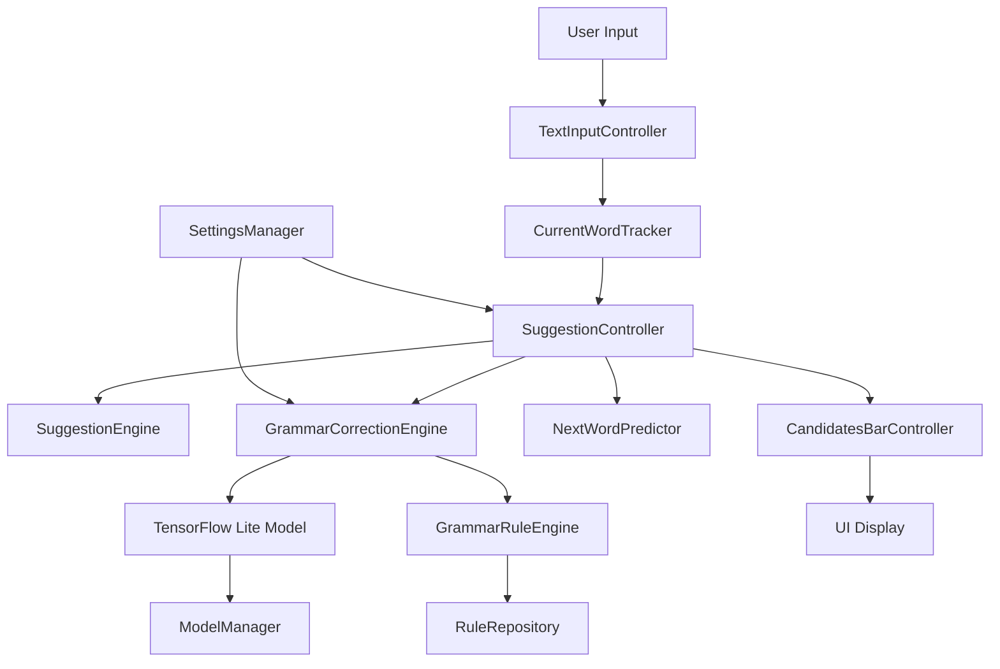
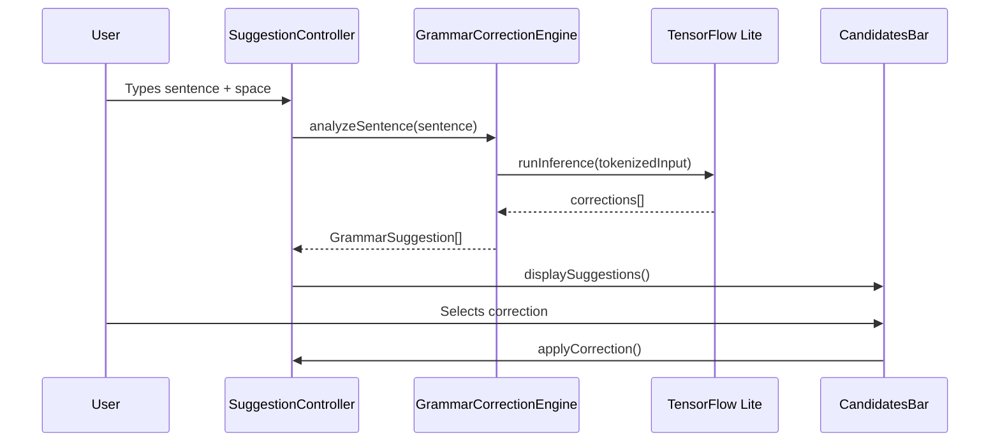

# AI-Powered Grammar Correction Feature - Technical Specification

## Overview

This specification outlines the design for an AI-powered grammar correction feature for the TitanKeys keyboard app. The feature will use TensorFlow Lite for on-device grammar checking and correction, integrating seamlessly with the existing suggestion and auto-correction systems.

## 1. Architecture Design

### Integration with Existing Components

The grammar correction feature will integrate as a new layer in the existing suggestion pipeline:

```
┌─────────────────┐    ┌──────────────────┐    ┌─────────────────┐
│ SuggestionEngine│    │AutoCorrectionMgr │    │GrammarCorrection│
│                 │    │                  │    │Engine           │
│ - Word spelling │    │ - Auto-replace   │    │ - Grammar rules │
│ - Proximity     │    │ - Boundary       │    │ - Context       │
│ - Dictionary    │    │   handling       │    │ - Style         │
└─────────────────┘    └──────────────────┘    └─────────────────┘
         │                       │                       │
         └───────────────────────┼───────────────────────┘
                                 │
                    ┌────────────────────┐
                    │SuggestionController│
                    │                    │
                    │- Orchestrates all  │
                    │  suggestion types  │
                    │- Manages UI display│
                    └────────────────────┘
```

### GrammarCorrectionEngine Class Structure

```kotlin
class GrammarCorrectionEngine(
    private val context: Context,
    private val modelManager: GrammarModelManager,
    private val settings: GrammarSettings
) {
    // Core components
    private val sentenceAnalyzer = SentenceAnalyzer()
    private val ruleEngine = GrammarRuleEngine()
    private val correctionSuggester = CorrectionSuggester()

    // Integration points
    fun analyzeSentence(sentence: String, cursorPosition: Int): List<GrammarSuggestion>
    fun getCorrectionsForWord(word: String, context: SentenceContext): List<Correction>
    fun isGrammarCheckEnabled(): Boolean
}
```

## 2. Model Requirements

### TensorFlow Lite Model Specifications

| Requirement | Specification |
|-------------|---------------|
| **Model Type** | Transformer-based sequence-to-sequence model (T5-small or similar) |
| **Input Format** | Tokenized text sequences (max 128 tokens) |
| **Output Format** | Grammar error spans with correction suggestions |
| **Model Size** | < 50MB (compressed) |
| **Quantization** | INT8 quantization for mobile optimization |
| **Input Tokenization** | SentencePiece or WordPiece tokenizer |
| **Supported Tasks** | Grammar error detection, correction suggestion, style improvement |

### Model Input/Output Schema

**Input:**
```json
{
  "text": "I goed to the store yesterday",
  "language": "en",
  "context_length": 50
}
```

**Output:**
```json
{
  "corrections": [
    {
      "error_span": [2, 5],  // "goed"
      "suggestion": "went",
      "confidence": 0.95,
      "error_type": "verb_tense"
    }
  ],
  "style_suggestions": [
    {
      "span": [0, 1],
      "suggestion": "Yesterday, I went to the store",
      "improvement_type": "sentence_structure"
    }
  ]
}
```

## 3. Trigger Conditions

### Automatic Triggers
- **Spacebar Press**: After completing a sentence (detected by period, question mark, exclamation)
- **Manual Check**: Dedicated grammar check button in suggestion bar
- **Cursor Movement**: When cursor moves to end of sentence
- **Text Selection**: When user selects text for grammar checking

### Smart Filtering
- Only trigger on sentences > 3 words
- Skip checking when typing speed > 200 WPM (likely drafting)
- Respect user settings for automatic vs manual checking
- Avoid triggering on code, URLs, or technical text

## 4. UI Integration

### Suggestion Display
```
┌─────────────────────────────────────────┐
│ I goed to the store yesterday.          │
├─────────────────────────────────────────┤
│ [went]  [go]  [gone]  [Check Grammar]   │
└─────────────────────────────────────────┘
```

### Grammar Check Dialog
```
┌─ Grammar Corrections ───────────────────┐
│ Sentence: I goed to the store yesterday │
│                                         │
│ Issues found:                           │
│ • "goed" → "went" (verb tense)          │
│ • Consider: "Yesterday, I went..."      │
│                                         │
│ [Apply All] [Apply] [Ignore] [Settings] │
└─────────────────────────────────────────┘
```

### Integration Points
- **CandidatesBarController**: Add grammar suggestions alongside word suggestions
- **SuggestionController**: Route grammar suggestions to appropriate UI components
- **NotificationHelper**: Haptic feedback for grammar corrections

## 5. Performance Constraints

### Inference Time Requirements
- **Target**: < 100ms per sentence analysis
- **Budget Breakdown**:
  - Model loading: < 20ms
  - Tokenization: < 10ms
  - Inference: < 50ms
  - Post-processing: < 20ms

### Battery Impact Mitigation
- **Batch Processing**: Analyze multiple sentences together
- **Caching**: Cache results for recently typed text
- **Throttling**: Limit checks during rapid typing
- **Background Processing**: Use WorkManager for non-urgent checks

### Memory Constraints
- **Model Memory**: < 100MB RAM usage
- **Working Memory**: < 10MB for sentence processing
- **Cache Size**: Limit to 50 recent sentences

## 6. Fallback Mechanisms

### When AI Model Unavailable
1. **Rule-Based Fallback**: Use pattern-based grammar rules
2. **Dictionary-Based**: Leverage existing spelling correction
3. **Offline Mode**: Disable grammar features gracefully
4. **Network Retry**: Attempt model download if network available

### Degradation Strategy
```kotlin
enum class GrammarFallbackLevel {
    FULL_AI,        // Full TensorFlow Lite model
    HYBRID,         // AI + rule-based
    RULES_ONLY,     // Pattern-based rules only
    DISABLED        // Grammar checking off
}
```

### Error Handling
- **Model Load Failure**: Fall back to rules-only mode
- **Inference Timeout**: Skip current sentence, continue with others
- **Memory Pressure**: Reduce model complexity or disable temporarily

## 7. Privacy Considerations

### On-Device Processing
- **Zero Data Transmission**: All processing occurs locally
- **No Cloud Dependencies**: Model runs entirely on device
- **No User Data Collection**: Grammar corrections not stored or shared
- **Temporary Caching Only**: Results cached in memory only

### Data Handling
- **Input Scope**: Only analyze current sentence being typed
- **No History**: Previous messages/conversations not accessible
- **Clear on Exit**: All cached data cleared when app closes
- **Opt-in Only**: Grammar checking requires explicit user consent

## 8. Multi-Language Support Strategy

### Language Detection and Model Management
```kotlin
class GrammarModelManager {
    private val models = mutableMapOf<String, GrammarModel>()

    fun getModelForLanguage(language: String): GrammarModel? {
        return models.getOrPut(language) {
            loadModelForLanguage(language)
        }
    }

    fun preloadCommonModels() {
        // Preload English, Spanish, French models
        listOf("en", "es", "fr").forEach { preloadModel(it) }
    }
}
```

### Supported Languages (Phase 1)
| Language | Model Size | Priority |
|----------|------------|----------|
| English  | 45MB      | High     |
| Spanish  | 42MB      | High     |
| French   | 44MB      | Medium   |
| German   | 46MB      | Medium   |
| Italian  | 41MB      | Low      |

### Language-Specific Features
- **English**: Focus on articles, prepositions, verb tenses
- **Spanish**: Gender agreement, subjunctive mood
- **French**: Liaison rules, agreement
- **German**: Case system, compound words
- **Italian**: Article contraction, verb conjugation

## Detailed Diagrams

### System Architecture Diagram


### Grammar Processing Flow


## Pseudocode for Key Components

### GrammarCorrectionEngine Core Logic
```kotlin
class GrammarCorrectionEngine {
    fun analyzeSentence(sentence: String, cursorPosition: Int): List<GrammarSuggestion> {
        // 1. Check if grammar checking is enabled
        if (!settings.grammarCheckEnabled) return emptyList()

        // 2. Validate sentence length and context
        if (sentence.length < MIN_SENTENCE_LENGTH) return emptyList()

        // 3. Tokenize and prepare input
        val tokens = tokenizer.tokenize(sentence)
        val modelInput = prepareModelInput(tokens, cursorPosition)

        // 4. Run inference with timeout
        val startTime = System.nanoTime()
        val rawResults = withTimeout(GRAMMAR_TIMEOUT_MS) {
            modelManager.runInference(modelInput)
        }
        val inferenceTime = (System.nanoTime() - startTime) / 1_000_000

        // 5. Filter and rank suggestions
        val suggestions = rawResults
            .filter { it.confidence > settings.minConfidence }
            .sortedByDescending { it.confidence }
            .take(settings.maxSuggestions)

        // 6. Apply post-processing rules
        return postProcessSuggestions(suggestions, sentence)
    }

    private fun prepareModelInput(tokens: List<String>, cursorPosition: Int): ModelInput {
        return ModelInput(
            text = tokens.joinToString(" "),
            language = currentLanguage,
            cursorPosition = cursorPosition,
            contextWindow = settings.contextWindowSize
        )
    }
}
```

### Integration with SuggestionController
```kotlin
// In SuggestionController.kt
fun getGrammarSuggestions(currentWord: String, sentenceContext: String): List<SuggestionResult> {
    val grammarEngine = grammarCorrectionEngine ?: return emptyList()

    // Get sentence boundaries
    val sentence = extractCurrentSentence(sentenceContext, currentWord)

    // Run grammar analysis
    val corrections = grammarEngine.analyzeSentence(sentence, currentWord.length)

    // Convert to SuggestionResult format
    return corrections.map { correction ->
        SuggestionResult(
            candidate = correction.suggestedText,
            distance = 0, // Grammar corrections have no edit distance
            score = correction.confidence * GRAMMAR_SCORE_MULTIPLIER,
            source = SuggestionSource.GRAMMAR
        )
    }
}
```

### Performance Monitoring
```kotlin
class GrammarPerformanceMonitor {
    private val metrics = mutableListOf<PerformanceMetric>()

    fun recordInferenceTime(model: String, timeMs: Long, success: Boolean) {
        metrics.add(PerformanceMetric(
            timestamp = System.currentTimeMillis(),
            model = model,
            operation = "inference",
            durationMs = timeMs,
            success = success
        ))

        // Adaptive adjustments
        if (timeMs > GRAMMAR_TIMEOUT_MS) {
            adjustModelComplexity(model, reduce = true)
        }
    }

    fun getAverageInferenceTime(): Double {
        return metrics
            .filter { it.success && it.operation == "inference" }
            .takeLast(100)
            .map { it.durationMs }
            .average()
    }
}
```

## Implementation Roadmap

### Phase 1: Core Infrastructure (Week 1-2)
- Add TensorFlow Lite dependency
- Create GrammarCorrectionEngine skeleton
- Implement basic model loading and inference
- Add grammar settings to SettingsManager

### Phase 2: Basic Grammar Checking (Week 3-4)
- Implement sentence boundary detection
- Add English grammar model
- Basic UI integration for suggestions
- Performance optimization and caching

### Phase 3: Advanced Features (Week 5-6)
- Multi-language support
- Style suggestions
- Fallback mechanisms
- Comprehensive testing and optimization

### Phase 4: Polish and Production (Week 7-8)
- User experience refinements
- Battery and memory optimization
- Privacy audit and compliance
- Documentation and release preparation

## Risk Mitigation

### Technical Risks
- **Model Size**: Use model compression and selective loading
- **Performance**: Implement progressive loading and background processing
- **Compatibility**: Test across Android API levels 29+

### User Experience Risks
- **False Positives**: Implement confidence thresholds and user feedback
- **Performance Impact**: Add user controls for enabling/disabling
- **Privacy Concerns**: Clear communication about on-device processing

### Business Risks
- **Model Accuracy**: Start with conservative suggestions
- **Resource Usage**: Monitor and optimize based on user feedback
- **Feature Adoption**: Make grammar checking opt-in with clear value proposition

This specification provides a comprehensive foundation for implementing AI-powered grammar correction in TitanKeys while maintaining the app's performance, privacy, and user experience standards.